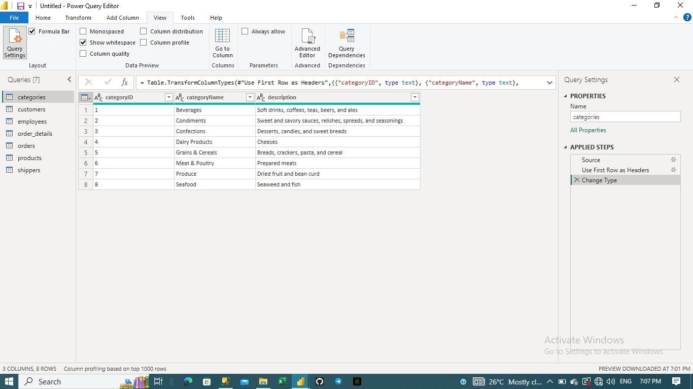

## INTRODUCTION
North Wind Traders is an import and export company, that specializes in the transport of food, beverages, gourmet and all sorts of goods. The company has been in operation for 3 years and has made significant progress and sales since the commencement of its operation. It has expanded across several countries in Europe and South America and has built solid customer loyalty. 
## PROBLEM STATEMENT 
After 3 years of operation, the company wants to take a deep look into its sales performance as it noticed a recent decline from previous sales performance. It employed my service as a data analyst to help draw insights into their performance in different areas of the business, These insights would be beneficial to the company in its decision-making process to improve their annual turnover and help them to cut costs in their operation process.
## METHODOLOGY 
To begin drawing insights for this company, i was provided with the company's dataset dating from July 2013 to September 2015. This dataset is made up of 7 different tables; categories, customers, employees, order, order details, products, and shippers; each table possesses different data and data types.
### **Tools Used**
- Microsoft PowerBI
- Power Query 
### Data Cleaning and Preprocessing
I began the data cleaning process by importing each table into the Microsoft PowerBI desktop platform, then proceeded to transform the data using Power Query. Starting with the **categories table**;

Upon exploration of this table's data, I discovered it consisted of the categories of products that the company ships across each nation of its operation to customers. It is made up of the category id column which I converted to a text data type from whole number datatype because we won't be summarising the data in the column, The table is also made up of the category name and its description which after exploration, no errors was found in the data.
#### **Customer**

To begin cleaning this table, I promoted the first row to the header position because the columns in the table had a default column name. I went on to standardize the customer id column to a proper text by capitalising the first letter in the column, after this no other error was found in the data.
#### **Employees**

To clean the employee table, i converted the employee id data type from whole number to text data type because no aggregation would be performed with this data. This table gives insight into the employees at the company, their various positions and their country. After converting the employee id column data type, i noticed a null value in the reports to column which tells to whom each employee reports their activities to, The column was deleted because it would not be needed in the analysis.
#### **Order Details**

This table contains the order id and details such as the product id, the price per unit, the discount applied to each order and the quantity of orders made. Going through this data, the only cleaning done was to convert the order id and product id whole number data type to text since no aggregations would be done with it.
#### **Orders**

This table contains columns showing details about each order, the customer id, the shipping details, the shipper id and freight details. I converted the order id, employee id, and shipper id to text data type and deleted the requirement date. 
#### **Products**

This table shows details about each product, the product id and category id columns were both converted to text data type and the rest of the data were valid without errors.
#### **Shippers**

The data type of shipper id column in this table was converted from whole number to text data type and the other column was without error.
## DASHBOARD
